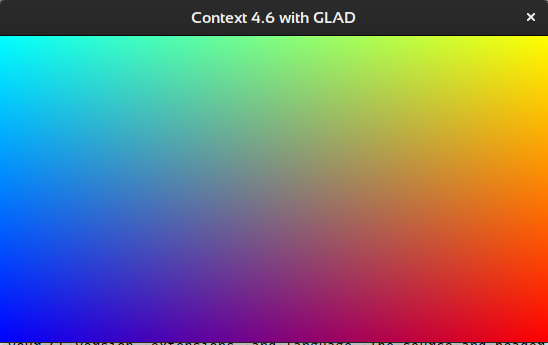

# OpenGL 4.6 Context with SDL2 and GLAD

Boilerplate Code.<br>

```shell
INFO: Version  : 4.6.0 NVIDIA 440.82
INFO: GLSL     : 4.60 NVIDIA
INFO: Context  : 4.6
```



## What is OpenGL?

3D graphics library specifications <https://www.opengl.org/>.

## What is SDL2?

Cross-platform development providing low level access to audio, keyboard, mouse, joystick, and graphics hardware via OpenGL, Vulkan and Direct3D.

<https://www.libsdl.org/><br>
<https://acry.github.io/SDL2-C.html><br>

## What is GLAD?

GLAD is a function loader for OpenGL.

Since there are many different versions of OpenGL drivers, the location of most of its functions is not known at compile-time and needs to be queried at run-time.

Setup of GLAD involves using a web server to generate source and header files specific to your GL version, extensions, and language. The source and header files are then placed in your project's src and include directories.

Used perma link:<br>
http://glad.dav1d.de/#profile=compatibility&specification=gl&api=gl%3D4.6&api=gles1%3Dnone&api=gles2%3Dnone&api=glsc2%3Dnone&language=c&loader=on
